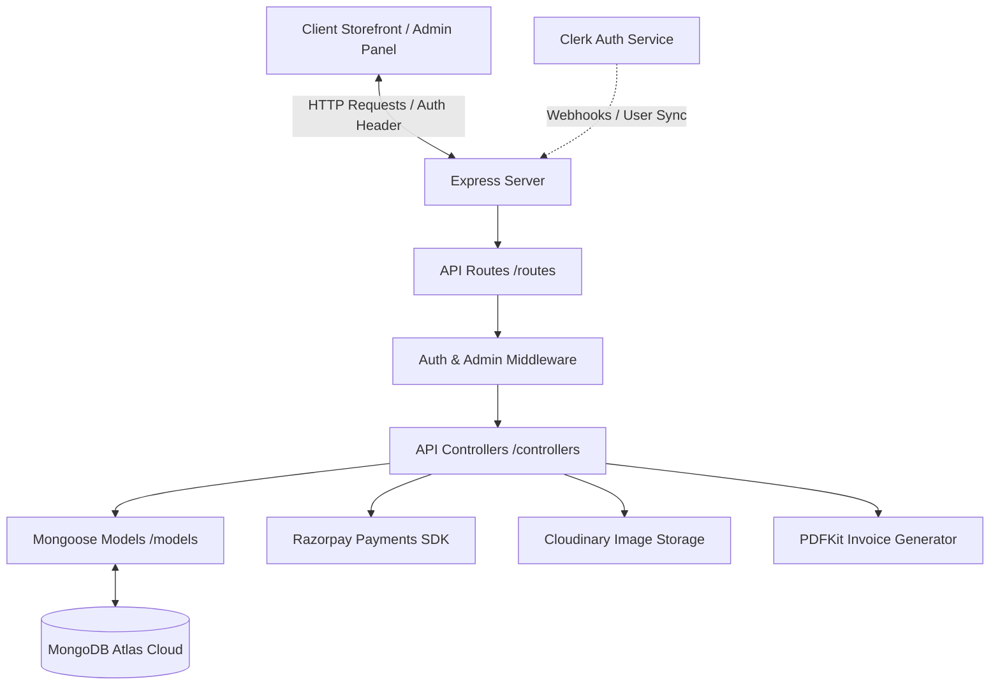

# 🚀 Thamizhoviyaa E-Commerce API

[](https://nodejs.org/)
[](https://expressjs.com/)
[](https://www.mongodb.com/)
[](https://mongoosejs.com/)
[](https://clerk.com/)
[](https://razorpay.com/)
[](https://cloudinary.com/)
[](https://opensource.org/licenses/MIT)

A robust, production-ready RESTful API powering the **Thamizhoviyaa E-Commerce Storefront**. Built on a modular Model-View-Controller (MVC) architecture using Node.js, Express, and Mongoose, it handles secure authentication, catalog management, server-side cart/wishlist persistence, Razorpay checkout integrations, dynamic PDF invoice generation, and admin dashboards.

---

## 🔗 Project Links & Live Demo
* **Live API Base URL:** `https://thamizhoviyaa-ecommerce-backend.onrender.com`
* **Frontend Repository:** [Frontend GitHub Repo](https://github.com/MarsalShyam/Thamizhoviyaa-ecommerce-frontend.git)
* **API Documentation Status:**  `Active & Operational`

---

## 🛠 Tech Stack & Core Libraries

- **Runtime Environment:** Node.js (v18+)
- **Framework:** Express.js (v5)
- **Database:** MongoDB Atlas (NoSQL) with Mongoose ORM
- **Authentication & Middleware:** Clerk Express SDK, Svix (for webhook validation)
- **Payment Gateway:** Razorpay Node SDK
- **File & Image Uploads:** Cloudinary, Multer (Memory Storage)
- **Document Generation:** PDFKit (Dynamic invoice & shipping label generation)
- **Email Notifications:** Nodemailer (SMTP mailers)

---

## 📐 Architecture & Workflow

This project is built using a clean MVC (Model-View-Controller) structure to decouple routing, database logic, and controllers.



---

## 📂 Directory Structure

```text
backend/
├── config/              # DB connection and configurations
├── controllers/         # Request handling & business logic
├── middleware/          # JWT protection, admin checks, error handling
├── models/              # Mongoose data schemas (User, Product, Order, etc.)
├── routes/              # Express API endpoint configurations
├── utils/               # Helper utilities (Cloudinary, PDF, mailers)
├── .env                 # Environment variables (git-ignored)
├── index.js             # Main server execution & setup entry point
└── package.json         # Node dependencies and execution scripts
```

---

## 💾 Database Schema Reference

The system uses **5 Core Mongoose Schemas** that handle e-commerce operations:

1. **User Schema (`User.js`):** Synchronized directly with Clerk using `clerkId`. Holds custom attributes like shipping/billing address books, roles (`isAdmin`), and a user-scoped wishlist references array.
2. **Product Schema (`Product.js`):** Feature-rich model supporting attributes, SEO metadata, sizing, custom review arrays, image galleries, weights, stock tracking, and structured brand/item details sections (`aboutThisItem`, `productInformation`).
3. **CartItem Schema (`CartItem.js`):** Persistent server-side cart tracker mapping products, custom sizing, prices, quantities, and user associations.
4. **Order Schema (`Order.js`):** Tracks billing details, order prices (tax, shipping, discount totals), checkout items, payment responses, tracking IDs, delivery status, and a full chronological timeline (`statusHistory`).
5. **Blog Schema (`Blog.js`):** Simple CMS model for dynamic educational and marketing blogs managed by the administrator.

---

## 📡 API Endpoints Documentation

All requests expect JSON payloads in the body. Protected routes require a valid **Clerk Bearer Token** in the authorization header: `Authorization: Bearer <token>`.

### 🔑 Authentication & Clerk Sync
| Method | Route | Description | Access |
| :--- | :--- | :--- | :--- |
| **POST** | `/api/webhooks/clerk` | Verification & Sync webhook for Clerk user creation/updates | Public (Svix Validated) |

### 🛍 Product Catalog
| Method | Route | Description | Access |
| :--- | :--- | :--- | :--- |
| **GET** | `/api/products` | Query products list (supports search & filters) | Public |
| **GET** | `/api/products/:id` | Retrieve single product details | Public |
| **POST** | `/api/products/:id/reviews` | Write reviews and ratings | Authenticated |
| **POST** | `/api/products/admin` | Create new product listing | Admin Only |
| **PUT** | `/api/products/admin/:id` | Update product details | Admin Only |
| **DELETE** | `/api/products/admin/:id`| Remove product from catalog | Admin Only |

### 👤 Profile, Cart & Wishlist
| Method | Route | Description | Access |
| :--- | :--- | :--- | :--- |
| **GET** | `/api/users/profile` | Retrieve profile and address book | Authenticated |
| **PUT** | `/api/users/profile` | Update profile information | Authenticated |
| **GET** | `/api/users/cart` | Get persistent server-side cart items | Authenticated |
| **POST** | `/api/users/cart` | Add product to cart / update item | Authenticated |
| **PUT** | `/api/users/cart/:productId` | Edit quantity of item in cart | Authenticated |
| **DELETE** | `/api/users/cart/:productId` | Remove item from cart | Authenticated |
| **GET** | `/api/users/wishlist` | Fetch wishlist items | Authenticated |
| **POST** | `/api/users/wishlist/:productId` | Toggle product in/out of wishlist | Authenticated |

### 💳 Checkout & Order Tracking
| Method | Route | Description | Access |
| :--- | :--- | :--- | :--- |
| **POST** | `/api/orders` | Create a new local order record | Authenticated |
| **GET** | `/api/orders/myorders` | Retrieve order history for the logged-in user | Authenticated |
| **GET** | `/api/orders/:id` | Fetch order details by ID | Authenticated / Admin |
| **POST** | `/api/orders/razorpay/create-order` | Initialize a Razorpay payment order | Authenticated |
| **POST** | `/api/orders/razorpay/verify` | Verify Razorpay signatures and mark order paid | Authenticated |
| **GET** | `/api/orders/stats` | Fetch sales analytics and totals dashboard | Admin Only |
| **GET** | `/api/orders` | View all customer orders | Admin Only |
| **PUT** | `/api/orders/:id/status` | Update delivery workflow (Ordered ➜ Packed ➜ Shipped ➜ Delivered) | Admin Only |

### 📑 Invoice Downloads & Media
| Method | Route | Description | Access |
| :--- | :--- | :--- | :--- |
| **GET** | `/api/pdf/invoice/:orderId` | Generates and downloads a custom PDF Invoice with Shipping Label | Public |
| **POST** | `/api/upload` | Upload image buffer directly to Cloudinary products folder | Admin Only |

---

## ⚙ Setup & Installation Guide

Follow these steps to run the backend API locally:

### 1. Prerequisites
Ensure you have the following installed:
* [Node.js](https://nodejs.org/) (v18.0.0 or higher)
* [MongoDB Atlas Account](https://www.mongodb.com/cloud/atlas) or a running local MongoDB instance.

### 2. Clone and Configure
Clone this repository and navigate into the backend folder:
```bash
cd backend
npm install
```

### 3. Setup Environment Variables
Create a `.env` file in the root of the `/backend` directory and add your credentials:

```ini
# Application configuration
PORT=5000
NODE_ENV=development

# Database connection
MONGODB_URI="mongodb+srv://<username>:<password>@cluster.mongodb.net/your-db-name?retryWrites=true&w=majority"

# Security (JWT fallback)
JWT_SECRET="generate_a_random_jwt_secret_here"
JWT_EXPIRES_IN=30d

# Clerk Authentication (Get these from your Clerk Dashboard)
CLERK_PUBLISHABLE_KEY="pk_test_..."
CLERK_SECRET_KEY="sk_test_..."
CLERK_WEBHOOK_SECRET="whsec_..."  # For user sync validations

# Razorpay credentials (Test mode keys)
RAZORPAY_KEY_ID="rzp_test_..."
RAZORPAY_KEY_SECRET="..."

# Cloudinary image hosting config
CLOUDINARY_CLOUD_NAME="your-cloudinary-name"
CLOUDINARY_API_KEY="your-api-key"
CLOUDINARY_API_SECRET="your-api-secret"
```

### 4. Running the Application

* **Development Mode (Auto-restart via nodemon):**
  ```bash
  npm run server
  ```
* **Production Mode:**
  ```bash
  npm start
  ```

Once running, the API will be available at `http://localhost:5000`. You can test it by visiting `http://localhost:5000/api/test` in your browser.

---

## 🛡 Security & Best Practices
* **Header Protection & CORS:** Configured cross-origin settings for clean backend-to-frontend handshakes.
* **Webhook Signature Verification:** The Clerk webhook endpoint uses raw stream body parsing verified through **Svix** to prevent spoofing.
* **Mongoose Sanitization & Error Middleware:** Custom error handlers catch validation and routing exceptions cleanly, hiding detailed stack traces in production mode.
